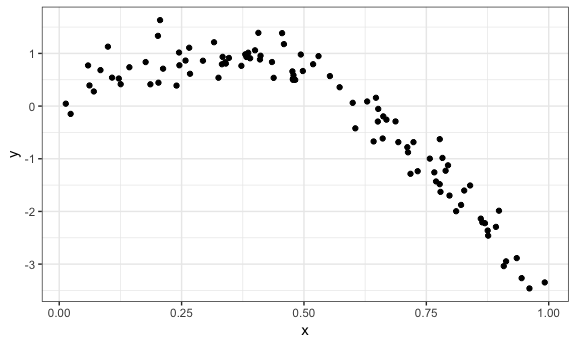
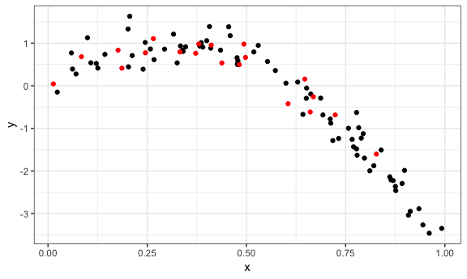
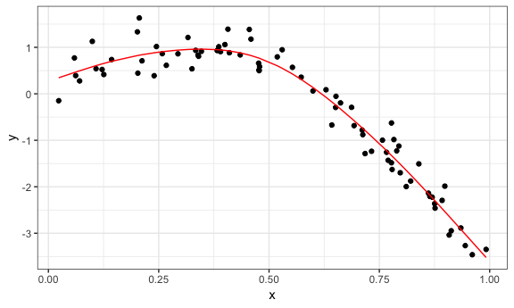
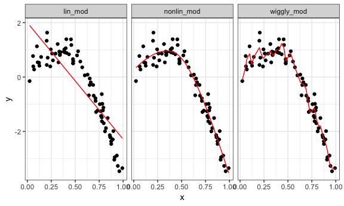
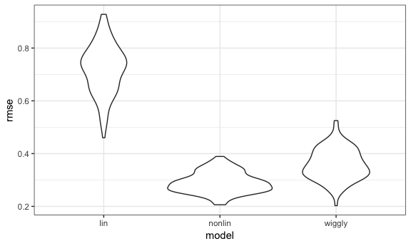
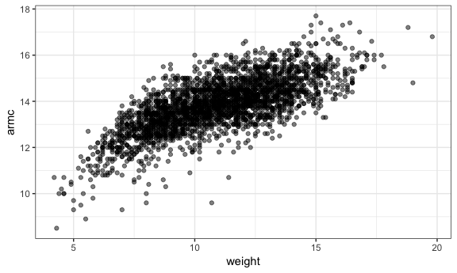
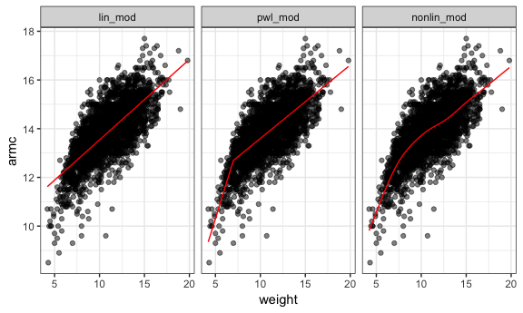
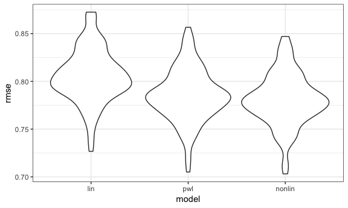

Cross Validation
================

Examples
--------

``` r
nonlin_df = tibble(
  id = 1:100,
  x = runif(100, 0, 1),
  y = 1 - 10 * (x - .3) ^ 2 + rnorm(100, 0, .3)
)

ggplot(nonlin_df, aes(x = x, y = y)) + geom_point() + theme_bw()
```



``` r
train_df = sample_n(nonlin_df, 80)
test_df = anti_join(nonlin_df, train_df, by = "id")

ggplot(train_df, aes(x = x, y = y)) + 
  geom_point() + 
  geom_point(data = test_df, color = "red")
```



``` r
lin_mod = lm(y ~ x, data = train_df)# not complex enough
nonlin_mod = mgcv::gam(y ~ s(x), data = train_df)#fit smooth curve
wiggly_mod = mgcv::gam(y ~ s(x, k = 30), sp = 10e-6, data = train_df)#overfitting, too complex, highly variable
```

``` r
train_df %>% 
  add_predictions(nonlin_mod) %>% 
  ggplot(aes(x = x, y = y)) + geom_point() + 
  geom_line(aes(y = pred), color = "red")
```



`gather_predictions`--adding predictions for several models and then gathering

``` r
train_df %>% 
  gather_predictions(lin_mod, nonlin_mod, wiggly_mod) %>% 
  mutate(model = fct_inorder(model)) %>% 
  ggplot(aes(x = x, y = y)) + 
  geom_point() + 
  geom_line(aes(y = pred), color = "red") + 
  facet_wrap(~model)
```



``` r
rmse(lin_mod, test_df)
## [1] 0.7163422

rmse(nonlin_mod, test_df)#pick lowest one
## [1] 0.2437012

rmse(wiggly_mod, test_df)
## [1] 0.3471883
```

``` r
cv_df = 
  crossv_mc(nonlin_df, 100) 
```

`resample` object is not compatible with `gam`

``` r
cv_df %>% pull(train) %>% .[[1]] %>% as_tibble
## # A tibble: 79 x 3
##       id     x       y
##    <int> <dbl>   <dbl>
##  1     1 0.266  1.11  
##  2     2 0.372  0.764 
##  3     3 0.573  0.358 
##  4     5 0.202  1.33  
##  5     7 0.945 -3.27  
##  6     8 0.661 -0.615 
##  7     9 0.629  0.0878
##  8    11 0.206  1.63  
##  9    12 0.177  0.836 
## 10    14 0.384  0.938 
## # ... with 69 more rows
cv_df %>% pull(test) %>% .[[1]] %>% as_tibble
## # A tibble: 21 x 3
##       id      x       y
##    <int>  <dbl>   <dbl>
##  1     4 0.908  -3.04  
##  2     6 0.898  -1.99  
##  3    10 0.0618  0.392 
##  4    13 0.687  -0.291 
##  5    15 0.770  -1.43  
##  6    17 0.718  -1.29  
##  7    23 0.652  -0.0535
##  8    42 0.647   0.158 
##  9    46 0.789  -1.23  
## 10    50 0.693  -0.684 
## # ... with 11 more rows

cv_df =
  cv_df %>% 
  mutate(train = map(train, as_tibble),
         test = map(test, as_tibble))
```

``` r
cv_df = 
  cv_df %>% 
  mutate(lin_mod    = map(train, ~lm(y ~ x, data = .x)),
         nonlin_mod = map(train, ~mgcv::gam(y ~ s(x), data = .x)),
         wiggly_mod = map(train, ~gam(y ~ s(x, k = 30), sp = 10e-6, data = .x))) %>% 
  mutate(rmse_lin    = map2_dbl(lin_mod, test, ~rmse(model = .x, data = .y)),
         rmse_nonlin = map2_dbl(nonlin_mod, test, ~rmse(model = .x, data = .y)),
         rmse_wiggly = map2_dbl(wiggly_mod, test, ~rmse(model = .x, data = .y)))
```

``` r
cv_df %>% 
  select(starts_with("rmse")) %>% 
  gather(key = model, value = rmse) %>% 
  mutate(model = str_replace(model, "rmse_", ""),
         model = fct_inorder(model)) %>% 
  ggplot(aes(x = model, y = rmse)) + geom_violin()
```



``` r
child_growth = read_csv("./data/nepalese_children.csv")
## Parsed with column specification:
## cols(
##   age = col_integer(),
##   sex = col_integer(),
##   weight = col_double(),
##   height = col_double(),
##   armc = col_double()
## )

skimr::skim(child_growth)
## Skim summary statistics
##  n obs: 2705 
##  n variables: 5 
## 
## ── Variable type:integer ──────────────────────────────────────────────────────────────
##  variable missing complete    n  mean    sd p0 p25 p50 p75 p100     hist
##       age       0     2705 2705 36.04 13.68 13  24  36  48   60 ▇▇▆▇▇▆▇▆
##       sex       0     2705 2705  1.47  0.5   1   1   1   2    2 ▇▁▁▁▁▁▁▇
## 
## ── Variable type:numeric ──────────────────────────────────────────────────────────────
##  variable missing complete    n  mean   sd   p0  p25  p50  p75  p100
##      armc       0     2705 2705 13.85 1.14  8.5 13.2 13.9 14.5  17.7
##    height       0     2705 2705 84.88 9.63 58.8 77.3 84.7 92.3 114  
##    weight       0     2705 2705 10.94 2.46  4.2  9.1 11   12.7  19.8
##      hist
##  ▁▁▁▃▇▆▂▁
##  ▁▃▇▇▆▆▂▁
##  ▁▃▇▇▇▃▁▁
child_growth %>% 
  ggplot(aes(x = weight, y = armc)) + 
  geom_point(alpha = .5)
```



Piecewise linear fit *spline term*

``` r
child_growth =
  child_growth %>% 
  mutate(weight_sp = (weight > 7) * (weight - 7))
```

``` r
lin_mod = lm(armc ~ weight, data = child_growth)
pwl_mod = lm(armc ~ weight + weight_sp, data = child_growth)
nonlin_mod = gam(armc ~ s(weight), data = child_growth)


child_growth %>% 
  gather_predictions(lin_mod, pwl_mod, nonlin_mod) %>% 
  mutate(model = fct_inorder(model)) %>% 
  ggplot(aes(x = weight, y = armc)) + 
  geom_point(alpha = .5) +
  geom_line(aes(y = pred), color = "red") + 
  facet_grid(~model)
```



``` r
cv_df =
  crossv_mc(child_growth, 100) %>% 
  mutate(train = map(train, as_tibble),
         test = map(test, as_tibble))
```

``` r
cv_df = 
  cv_df %>% 
  mutate(lin_mod = map(train, ~lm(armc ~ weight, data = .x)),
         pwl_mod = map(train, ~lm(armc ~ weight + weight_sp, data = .x)),
         nonlin_mod = map(train, ~gam(armc ~ s(weight), data = as_tibble(.x)))) %>% 
  mutate(rmse_lin    = map2_dbl(lin_mod, test, ~rmse(model = .x, data = .y)),
         rmse_pwl = map2_dbl(pwl_mod, test, ~rmse(model = .x, data = .y)),
         rmse_nonlin = map2_dbl(nonlin_mod, test, ~rmse(model = .x, data = .y)))
```

depends a bit on the need to balance complexity with goodness of fit and interpretability

``` r
cv_df %>% 
  select(starts_with("rmse")) %>% 
  gather(key = model, value = rmse) %>% 
  mutate(model = str_replace(model, "rmse_", ""),
         model = fct_inorder(model)) %>% 
  ggplot(aes(x = model, y = rmse)) + geom_violin()
```


